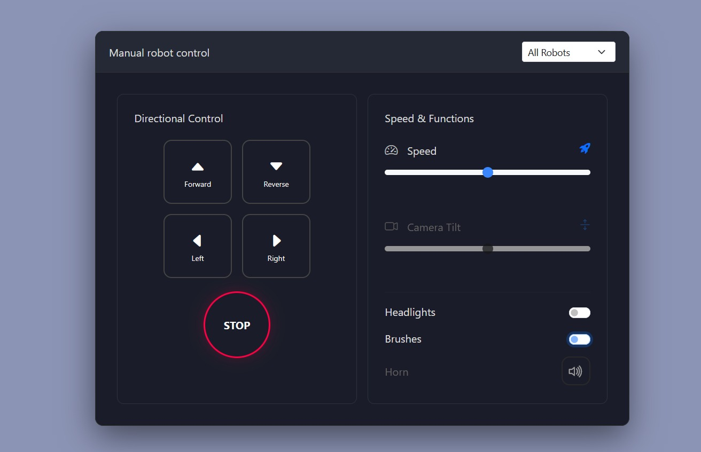

> # README structure:
> - links to video and presentation  
> - hardware/software requirements  
> - source code organization  
> - how to build, burn and run  
> - user guide  
> - team members and their contributions  

# Work-E
3 robots who will overtake the universe (and small paper blocks)  

  

*From left to right: Delta, Charlie, Beta*

This repository documents the architecture, communication flow, and API surface of a simple robotic control system composed of a **web-based GUI**, a **Python backend**, and multiple UDP-connected **robot nodes** (MCUs).  

## Links to video and presentation
[Video]()  
[Presentation PDF]()

## Requirements

### Hardware
Here are all the required componets for each of the robots:  

**(pls tell me if it needs to be any more specific)**

<h3 style="text-align: center;">Charlie</h3>

  

- 1x ESP32 board DevKit 36 GPIOs
- 4x DC motors N30
- 2x Drivers DRV8833
- 1x Servo motor SG90
- 1x Radar module VL53L0X
- 1x I2C generic OLED screen 0.91"
- 2x LED lights (red, green)
- Custom 3D-printed structure, including:
  - 1x Base
  - 4x Wheels
  - 2x Rotating arms (to sweep obstacles away)
  - **(anything else?)**

<h3 style="text-align: center;">Delta</h3>

  

- 1x ESP32 board DevKit 36 GPIOs
- 2x DC motors N30
- 1x Driver DRV8833
- 3x Servo motors SG90
- 1x Radar module VL53L0X
- 1x I2C generic OLED screen 0.91"
- 2x LED lights (red, green)
- Custom 3D-printed structure, including:
  - 1x Base
  - 4x Wheels
  - x1 Gripper (to collect paper blocks)
  - **(anything else?)**

<h3 style="text-align: center;">Beta</h3>

  

- 1x ESP32 board DevKit 36 GPIOs
- 3x DC motors N30
- 2x Drivers DRV8833
- 1x Servo motor SG90
- 1x Radar module VL53L0X
- 1x I2C generic OLED screen 0.91"
- 2x LED lights (red, blue)
- Custom 3D-printed structure, including:
  - 1x Base
  - 4x Wheels
  - 1x Trunk (to carry and discharge paper blocks)
  - **(anything else?)**

### Software
- [Visual Studio Code](https://code.visualstudio.com/)
- [PlatformIO](https://docs.platformio.org/en/latest/integration/ide/vscode.html) extension for VS Code
- [Pycharm](https://www.jetbrains.com/pycharm/) to run the central server

## Source code organization
Each part of the project (Charlie, Delta, Beta and the server) was developed on its own dedicated branch.  

Below is the final project structure:

<code>
inserire schemino bellissimo (da fare dopo il mega merge)
</code>

## How to build and run the project
**(This part should be refined)**  

The robots come fully assembled already, therefore it is only needed to setup the corresponding softwares, burn it onto the ESP boards, setup the Python server and connect to the control interface using your smartphone.  

### Steps
1. Clone this repository
2. Open the project both in VS Code and Pycharm
3. **In VS Code:** For each robot, build the respective project in **(ADD PATH HERE)** and burn it on its respective board
4. **In Pycharm:** Go to **(ADD PATH HERE)** and run the corresponding script to launch the server
5. Using your smartphone, connect to the server to access the remote controller

## User guide
**(To be changed once we have the final version of the GUI)**

Here is what the remote controller GUI looks like:

  

Each button on the screen corresponds to a different command to be performed by the robot.  
**Note:** each robot has different skills!

**(insert here all the specifics)**

## Team members
Alex Calò  
Diego Emmanuel Vera Gómez  
Gioele Sesso  
Jacopo Marchesin  
