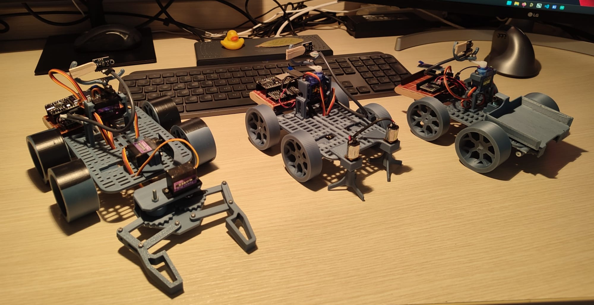
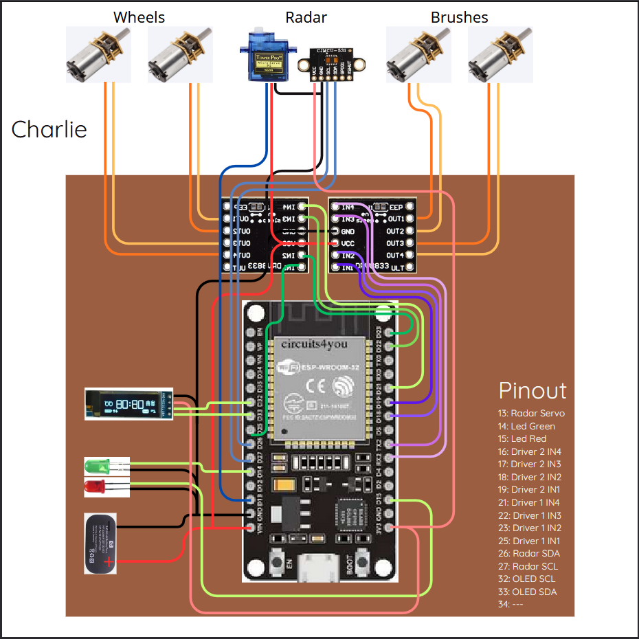
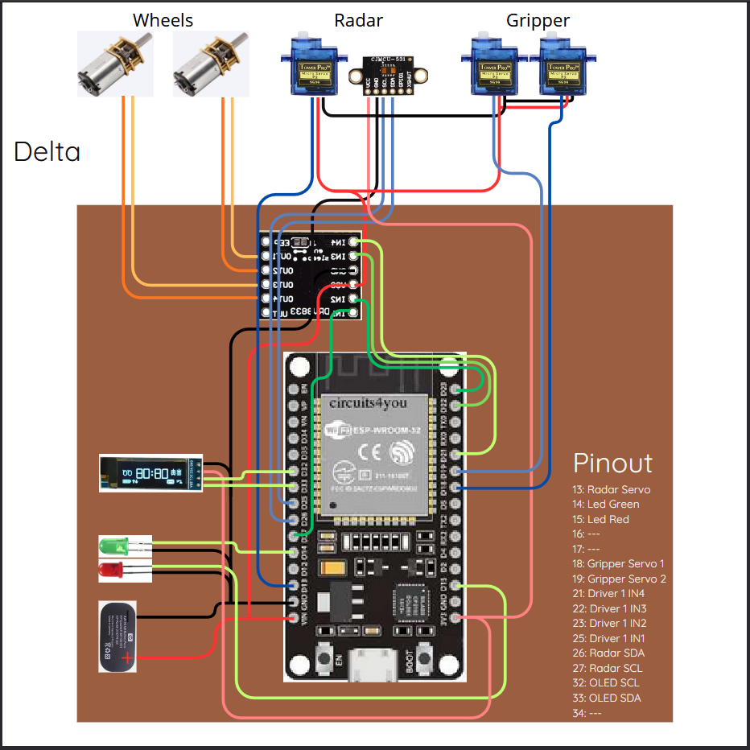
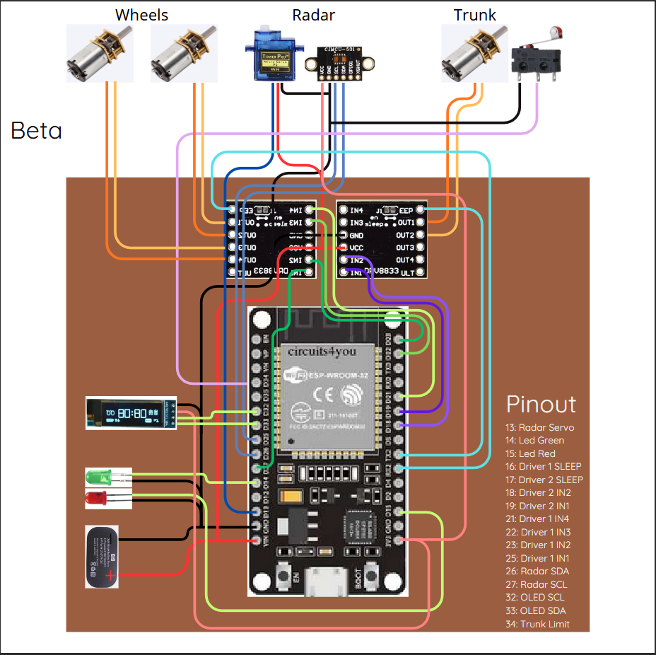
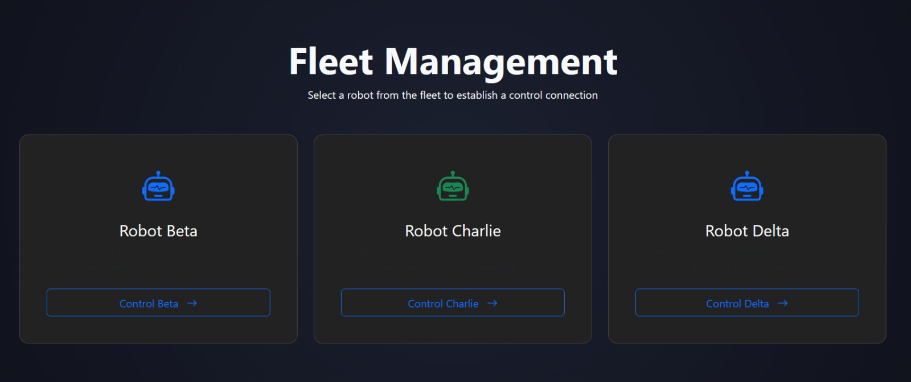
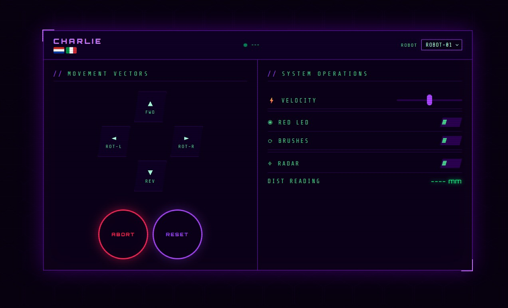
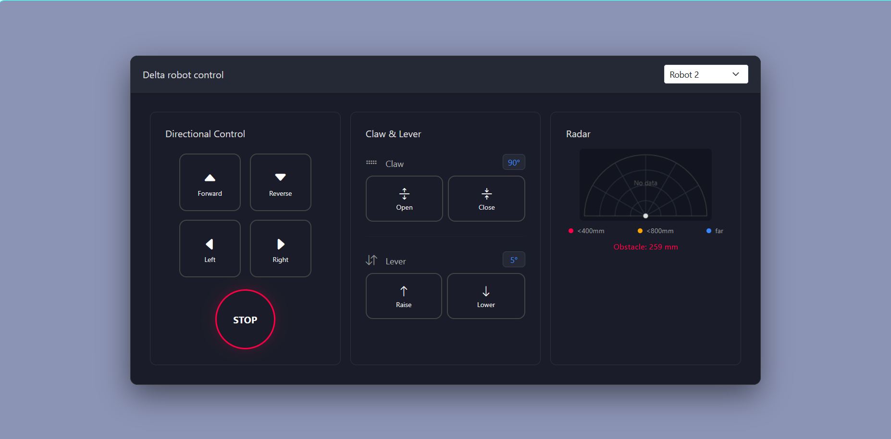
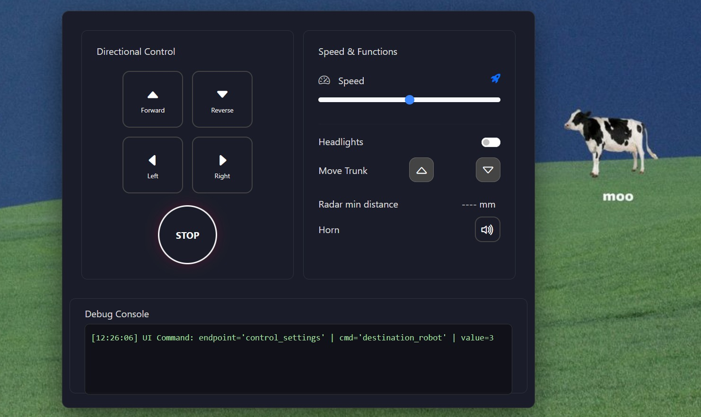

> # README structure:
> - links to video and presentation  
> - hardware/software requirements  
> - source code organization  
> - how to build, burn and run  
> - user guide  
> - team members and their contributions  

# Work-E
3 robots who will overtake the universe (and small paper blocks)  

  

*From left to right: Delta, Charlie, Beta*

This repository documents the architecture, communication flow, and API surface of a simple robotic control system composed of a **web-based GUI**, a **Python backend**, and multiple UDP-connected **robot nodes** (MCUs).  

## Links to video and presentation
[Video]()  
[Presentation PDF]()

## Requirements

### Hardware
Here are all the required componets for each of the robots:  

<h3 style="text-align: center;">Charlie</h3>

  

- 1x ESP32 board DevKit 36 GPIOs
- 4x DC motors N30
- 2x Drivers DRV8833
- 1x Servo motor SG90
- 1x Radar module VL53L0X
- 1x I2C generic OLED screen 0.91"
- 2x LED lights (red, green)
- Custom 3D-printed structure, including:
  - 1x Base
  - 4x Wheels
  - 2x Rotating arms (to sweep obstacles away)

<h3 style="text-align: center;">Delta</h3>

  

- 1x ESP32 board DevKit 36 GPIOs
- 2x DC motors N30
- 1x Driver DRV8833
- 3x Servo motors SG90
- 1x Radar module VL53L0X
- 1x I2C generic OLED screen 0.91"
- 2x LED lights (red, green)
- Custom 3D-printed structure, including:
  - 1x Base
  - 4x Wheels
  - x1 Gripper (to collect paper blocks)

<h3 style="text-align: center;">Beta</h3>

  

- 1x ESP32 board DevKit 36 GPIOs
- 3x DC motors N30
- 2x Drivers DRV8833
- 1x Servo motor SG90
- 1x Radar module VL53L0X
- 1x I2C generic OLED screen 0.91"
- 2x LED lights (red, blue)
- Custom 3D-printed structure, including:
  - 1x Base
  - 4x Wheels
  - 1x Trunk (to carry and discharge paper blocks)

### Software
- [Visual Studio Code](https://code.visualstudio.com/)
- [PlatformIO](https://docs.platformio.org/en/latest/integration/ide/vscode.html) extension for VS Code
- [Pycharm](https://www.jetbrains.com/pycharm/) to run the central server

## Source code organization
Each part of the project (Charlie, Delta, Beta and the server) was developed on its own dedicated branch.  

Below is the final project structure:

<code>
inserire schemino bellissimo (da fare dopo il mega merge)
</code>

## How to build and run the project

The robots come fully assembled already, therefore it is only needed to setup the corresponding softwares, burn it onto the ESP boards, setup the Python server and connect to the control interface using your smartphone.

**Network setup:**
All robots and the server share the same WiFi hotspot. Before starting anything:
Create a WiFi hotspot on the machine that will run the server, using these credentials:
SSID: local_hotspot
Password: esp32_mcu
The server machine will always be reachable at 192.168.137.1 (hotspot gateway). No additional network configuration is needed, since each robot sends an online notification that the server uses to register its IP automatically.

### Steps
1. Clone this repository.
2. Open the project both in VS Code and Pycharm.
3. **In VS Code:** For each robot, build the respective project and burn it on its respective board, using "Upload and Monitor".
4. **In Pycharm:** Run the server starting executing main.py to launch the server.
5. Start the server before powering the robots. If the server is not running at that moment, the IP mapping will be missing until the robot reboots.
6. Using your smartphone, connect to the server to access the remote controller.

# User Guide

The robot control system is accessed through a web-based interface that allows users to remotely monitor and operate a robot in real time.

## Multi-Robot Support

The control system supports multiple robots through a common interface. The specific robot being controlled is selected by the application configuration, and the active robot identifier is shown internally by the system. This unified design provides a consistent user experience while allowing robot-specific capabilities to be managed through the same control panel.

The robot interfaces are divided into two main sections:

## Directional Control

The left panel contains the movement controls used to drive the robot:

* **Forward**: Moves the robot ahead while the button is pressed.
* **Reverse**: Moves the robot backward while the button is pressed.
* **Left**: Rotates or steers the robot to the left.
* **Right**: Rotates or steers the robot to the right.
* **STOP**: Immediately halts all robot movement.

## Speed & Functions

The right panel provides access to robot settings and auxiliary functions:

* **Speed Slider**: Adjusts the robot's movement speed.
* **Headlights Switch**: Turns the robot's headlights on or off.
* **Move Trunk Controls**: Raises or lowers the trunk mechanism.
* **Brushes Toggle**: turns both brush motors on/off.
* **Claw Controls**: Controls the claw mechanism.
* **Radar Distance Indicator**: Displays the minimum distance detected by the radar sensor.
* **Horn Button**: Activates the robot horn.
* **Reset Button**: Sends a reset command to the robot and restores its default operating state.

The customized interfaces are:

Charlie

Delta 

Beta

## Team members
Alex Calò  
Diego Emmanuel Vera Gómez  
Gioele Sesso  
Jacopo Marchesin  
